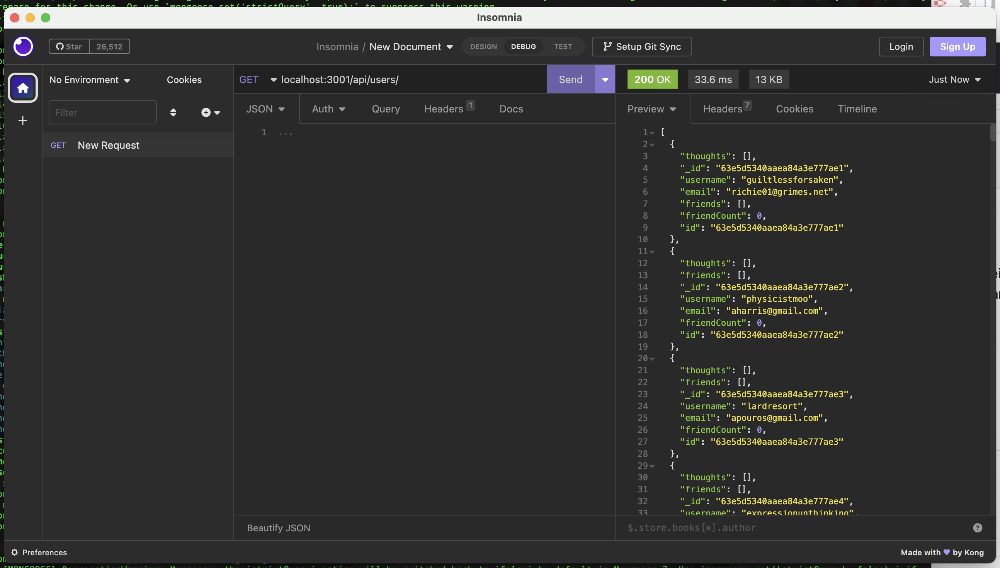

# Social Network API

## Description

An API for a social network web application where users can share their thoughts, react to friends’ thoughts, and create a friend list.

## Table of Contents

- [Image](#image)
- [Installation](#installation)
- [Usage](#usage)
- [Credits](#credits)
- [License](#license)
- [Testing](#testing)
- [Questions](#questions)

# Section

## Image

## Installation

Download the github repository by running 'git clone https://github.com/aphexgil/social-network-api', then navigate into the directory with 'cd social-network-api'. Within this directory, run 'npm i' to install all the necesscary packages, run 'node utils/seed' to seed the database, and run 'node index' to start the server.

## Usage

User can query the 'users' database from Insomnia (or their preferred workspace) with the routes
  `GET http://locahost:3001/api/users/` to see all user data, 
  `GET http://localhost:3001/api/users/:userId` to get  detailed information a single user,
  `POST http://localhost:3001/api/users/` with headers `username` and `email` to add a new user to the database,
  `PUT http://localhost:3001/api/users/:userId` with at least one of `username` or `email` in the header to update a single user's data,
  `POST http://localhost:3001/api/users/:userId/friends/:friendId` to add two users to each other's friend lists,
  and `DELETE http://localhost:3001/api/users/:userId/friends/:friendId`.
User can query the 'thoughts' database with the routes 
  `GET http://localhost:3001/api/thoughts/` to see all thought data,
  `GET http://localhost:3001/api/thoughts/:thoughtId` to get detailed information on a single thought,
  `POST http://localhost:3001/api/thoughts/` with headers "username" and `thoughtText` to add a new thought to the database,
  `PUT http://localhost:3001/api/thoughts/:thoughtId` with at least one of `username` or `thoughtText` in the header to update a single thought,
  and `DELETE http://localhost:3001/api/thoughts/:thoughtId` to delete a single thought.
Additionally, users can add reactions to thoughts with
  `POST http://localhost:3001/api/thoughts/:thoughtId/reactions/` with headers `username` and `reactionBody`,
  and can delete reactions with `DELETE http://localhost:3001/api/thoughts/:thoughtId/reactions` with `reacitonId` in the header. 

## Credits

None

## License

  This software is covered under MIT License. To find out more, visit [MIT License](https://opensource.org/licenses/MIT)

## Testing

No tests provided at this time.

## Questions

If you have any questions, direct them to https://github.com/aphexgil or gil.young.1994@gmail.com.
